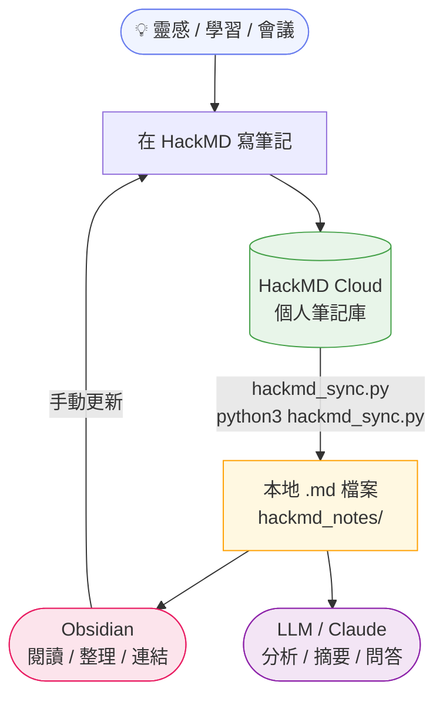

# HackMD 筆記同步工具

將 HackMD 個人筆記下載為本地 `.md` 檔案，供 Obsidian 或 LLM 讀取使用。

## 使用情境



## 環境需求

- Python 3.10+
- 套件：`requests`、`python-dotenv`

```bash
pip install requests python-dotenv
```

## 設定

### 1. 取得 HackMD API Token

HackMD → 右上角頭像 → **Settings** → **API** → 建立新 token（需勾選 Read 權限）

### 2. 設定 `.env`

複製 `.env.example` 並填入 token：

```bash
cp .env.example .env
```

編輯 `.env`：

```
HACKMD_TOKEN=你的token
```

## 使用方式

### 下載 / 同步筆記

```bash
python3 hackmd_sync.py
```

- 已是最新的筆記會自動略過，不重複下載
- 只有 HackMD 有更新的筆記才會重新下載

### 其他選項

```bash
# 指定輸出目錄（預設：./hackmd_notes）
python3 hackmd_sync.py --output-dir ./my_notes

# 同時下載 Team workspace 的筆記
python3 hackmd_sync.py --include-teams

# 不加 YAML frontmatter
python3 hackmd_sync.py --no-frontmatter

# 比對 local 與 HackMD 的差異（不下載）
python3 hackmd_sync.py --compare
```

## 輸出目錄結構

```
hackmd_notes/
├── 個人筆記/
│   ├── {tag名稱}/       ← 以第一個 tag 作為子目錄
│   │   └── 筆記標題.md
│   └── 筆記標題.md      ← 無 tag 的筆記
└── sync_failures.log    ← 下載失敗記錄（若有）
```

每個 `.md` 檔案包含 YAML frontmatter：

```yaml
---
title: "筆記標題"
tags:
  - tag1
created: 2026-01-01 12:00:00
updated: 2026-04-16 09:00:00
hackmd_id: "xxxxxxxxxxxx"
---
```

## 常見問題

### 圖片無法顯示

圖片連結為 HackMD 遠端 URL，需要網路連線。在 Obsidian 中請切換至**閱讀檢視**（右上角書本圖示）即可正常顯示。

### 下載失敗（429 Too Many Requests）

HackMD 免費方案每 30 天上限 2000 次 API 呼叫。遇到限速時腳本會自動等待並重試。若整批失敗，稍後重新執行即可（已下載的筆記不會重複下載）。

### Token 更換

只需修改 `.env` 檔案中的 `HACKMD_TOKEN`，不需要改動腳本。
